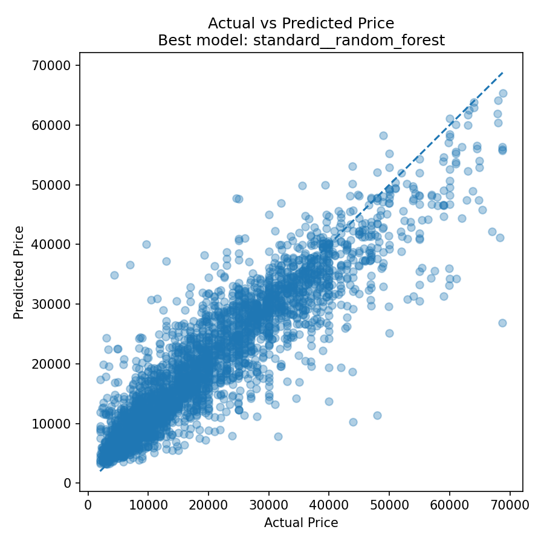
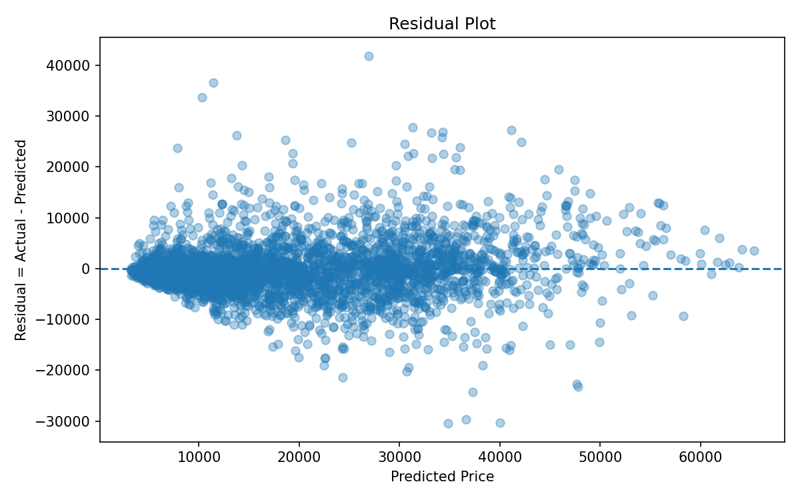
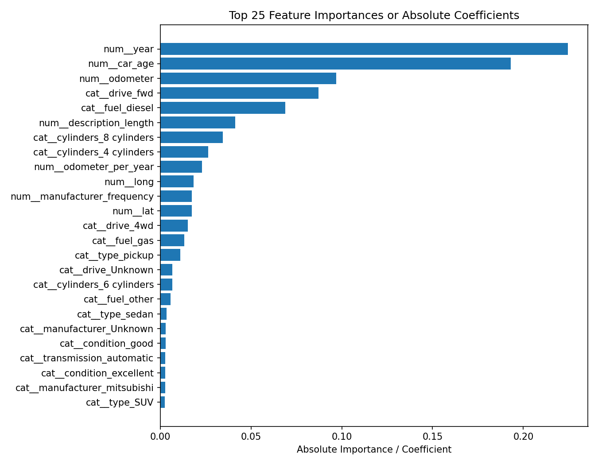
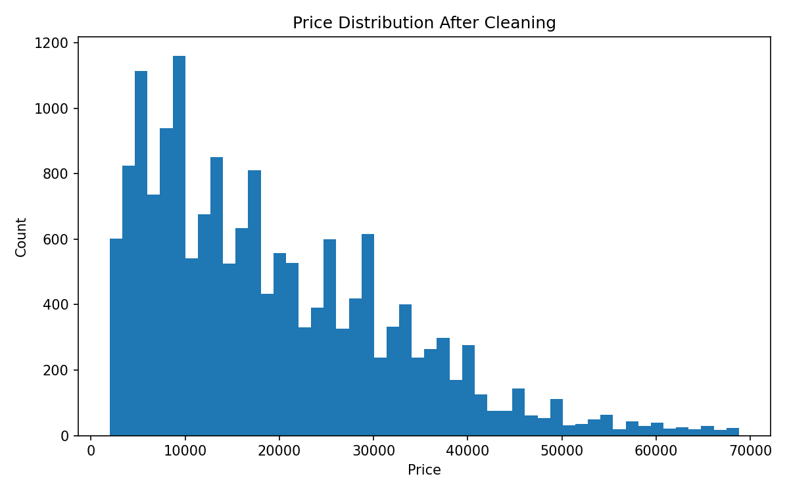

# Used Car Fair Price Prediction and Deal Detection

A Data Science term-project pipeline for predicting fair used-car prices from Craigslist vehicle listings.

## Project Objective

Buying a used car is difficult because the listed price depends on many factors, including vehicle age, mileage, manufacturer, model, condition, fuel type, transmission, drive type, and location. This project builds a regression-based machine learning pipeline to estimate a fair price and then compares the predicted price with the actual listed price to identify potentially overpriced or underpriced listings.

## Dataset

- Source: Kaggle Craigslist Vehicles Dataset
- Raw dataset: 426,880 rows × 26 columns
- Working dataset: reproducible random sample of 20,000 rows, generated with random seed 42
- Cleaned modeling dataset: 16,921 rows × 25 columns
- Target variable: `price`

The raw dataset is not included because of file-size constraints. To reproduce the sample, download `vehicles.csv` from Kaggle, place it in `data/`, and run:

```bash
python scripts/create_random_sample.py
```

## Repository Structure

```text
.
├── main.py
├── requirements.txt
├── data/
│   ├── README.md
│   └── used_cars_cleaned_for_modeling.csv
├── docs/
│   ├── function_specification.md
│   └── project_summary.md
├── outputs/
│   ├── 04_cleaning_report.txt
│   ├── 06_model_leaderboard.csv
│   ├── 07_final_test_predictions.csv
│   ├── 09_feature_importance.csv
│   ├── 10_modeling_summary.txt
│   ├── 11_good_deal_examples_filtered.csv
│   ├── 12_overpriced_examples_filtered.csv
│   └── *.png
├── scripts/
│   └── create_random_sample.py
└── src/
    └── used_car_project_pipeline.py
```

## Main Techniques

- Dirty data handling
- Missing-value imputation
- Outlier filtering
- Feature engineering
- Rare-category grouping
- Numerical feature scaling
- Categorical feature encoding
- 5-fold cross-validation
- Regression model comparison
- Feature importance analysis
- Price-gap and deal-score analysis

## Feature Engineering

Created features include:

- `car_age`
- `odometer_per_year`
- `is_high_mileage`
- `posting_year`
- `posting_month`
- `description_length`
- `manufacturer_frequency`

## Models Compared

- DummyRegressor
- Ridge Regression
- RandomForestRegressor

Each model was tested with StandardScaler and RobustScaler. The final model was selected based on cross-validation performance and evaluated on a held-out test set.

## Final Results

Best model: **StandardScaler + RandomForestRegressor**

| Experiment | CV MAE | CV RMSE | CV R² | Test MAE | Test RMSE | Test R² | Test MAPE |
|---|---:|---:|---:|---:|---:|---:|---:|
| StandardScaler + Random Forest | 3,817.13 | 5,717.10 | 0.8073 | 3,688.99 | 5,467.53 | 0.8339 | 27.88% |
| RobustScaler + Random Forest | 3,817.07 | 5,717.42 | 0.8073 | 3,690.01 | 5,473.11 | 0.8336 | 27.90% |
| RobustScaler + Ridge | 5,052.01 | 7,113.25 | 0.7018 | 5,161.66 | 7,164.12 | 0.7148 | 44.49% |
| DummyRegressor | 10,311.70 | 13,405.26 | -0.0590 | 10,687.16 | 13,949.70 | -0.0812 | 83.78% |

## Visualizations

### Actual vs Predicted Price



### Residual Plot



### Feature Importance



### Price Distribution After Cleaning



## How to Run

Install dependencies:

```bash
pip install -r requirements.txt
```

Prepare data:

```bash
# Place the original Kaggle vehicles.csv in data/ first.
python scripts/create_random_sample.py
```

Run the full pipeline:

```bash
python main.py
```

The output files will be saved in `outputs/`.

## Main Function

The core reusable function is:

```python
run_used_car_regression_experiments(
    df,
    target="price",
    scalers=("standard", "robust"),
    models=("dummy", "ridge", "random_forest"),
    cv=5,
    test_size=0.2,
    random_state=42,
)
```

See `docs/function_specification.md` for details.

## Limitations

- The target is the listed price, not the final transaction price.
- Accident history, trim level, maintenance records, and number of previous owners are not available.
- Very high-priced vehicles still have larger residuals because luxury/rare options are not fully represented in the dataset.

## Team

Team 2: 정문석, 이재서, 임준서
